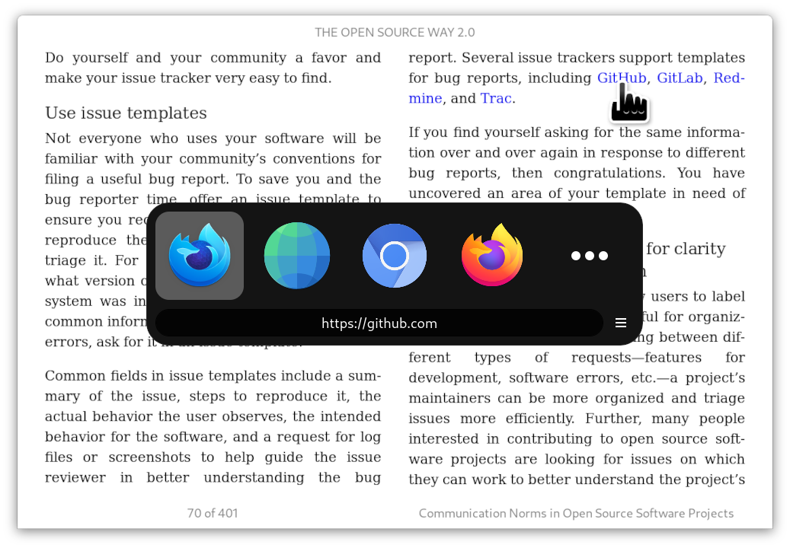

# Junction

Junction lets you choose the application to open files and links.



<a href='https://flathub.org/apps/details/re.sonny.Junction'></a>

## Usage

Set Junction as the default application for a resource and let it do the rest. Junction will pop up and offer multiple options to handle it.

<details>
  <summary>Set Junction as default browser</summary>
  <code>
  xdg-settings set default-web-browser re.sonny.Junction.desktop
  </code>
</details>

<details>
  <summary>Set Junction as default for all files</summary>
  <code>
   xdg-mime default re.sonny.Junction.desktop x-scheme-handler/file
  </code>

Please note that this may not be respected by all applications but the command `xdg-open` will.

</details>

<details>
  <summary>Set Junction as default for png</summary>
  <code>
  xdg-mime default re.sonny.Junction.desktop image/png
  </code>
</details>

<details>
  <summary>Set Junction as default email composer</summary>
  <code>
  xdg-settings set default-url-scheme-handler mailto re.sonny.Junction.desktop
  </code>
</details>

<details>
  <summary>Set Junction as default folder opener</summary>
  <code>
  xdg-settings default re.sonny.Junction.desktop inode/directory
  </code>
</details>

## Tips and tricks

<details>
  <summary>Keyboard navigation</summary>

Use the arrows to select your choice and press ⏎ to confirm.

Press `<Ctrl>C` to copy the resource location to the clipboard.

Press `<Ctrl>W` or `Esc` to close and cancel.

</details>

<details>
  <summary>Open with multiple applications</summary>

Use middle-click to keep Junction open - allowing you to open the resource in multiple applications.

</details>

<details>
  <summary>Make Junction appear in the center of the screen</summary>

On GNOME you can make all new windows open in the center using

```sh
gsettings set org.gnome.mutter center-new-windows true
```

See https://gitlab.gnome.org/GNOME/mutter/-/issues/246

</details>

<details>
  <summary>Use Junction from the terminal</summary>

Create a permant alias, for example `alias open="flatpak run re.sonny.Junction"`.

Then you can use `open my-file`.

See [How To Create Permanent Aliases In Linux?](https://fossbytes.com/alias-in-linux-how-to-use-create-permanent-aliases/)

</details>

<details>
  <summary>Add custom scripts to Junction</summary>

You can add your own script to Junction by creating a `.desktop` file for it in `~/.local/share/applications`.

See https://wiki.archlinux.org/title/desktop_entries (distro agnostic).

</details>

<details>
  <summary>Open links on a website with Junction</summary>

If you want links on your favorite websites to open Junction, set it as the default browser and use [Tangram](https://github.com/sonnyp/Tangram/).

A browser extension might be coming.

</details>

<details>
  <summary>Multiple Firefox profiles</summary>

See [Profile Manager - Create, remove or switch Firefox profiles](https://support.mozilla.org/en-US/kb/profile-manager-create-remove-switch-firefox-profiles)

If you want to be able to choose the Firefox profile to open the resource with, you can make desktop files for your Firefox profiles in `~/.local/share/applications`.

Here is an example `~/.local/share/applications/firefox-work.desktop`

```ini
[Desktop Entry]
Version=1.0
Name=Firefox work
Exec=firefox -P work --class=firefox-work %u
Icon=firefox
Terminal=false
Type=Application
StartupWMClass=firefox-work
MimeType=text/html;text/xml;application/xhtml+xml;application/vnd.mozilla.xul+xml;text/mml;x-scheme-handler/http;x-scheme-handler/https;
StartupNotify=true
```

Save, run `update-desktop-database ~/.local/share/applications`, enjoy.

[Reference](https://github.com/sonnyp/Junction/issues/9)

</details>

## Troubleshooting

<details>
  <summary>I can't distinguish between 2 options with the same icon</summary>

A quick workaround is to hover the application with the mouse cursor to show a tooltip with the name.

You can edit the desktop files to use distinctive icons, here are a some tools

- [MenuLibre](https://bluesabre.org/menulibre/) GUI
- [AppEditor](https://flathub.org/apps/details/com.github.donadigo.appedito) GUI - Flatpak
- [ArchWiki](https://wiki.archlinux.org/title/desktop_entries) advanced

</details>

<details>
  <summary>My app doesn't show up</summary>

If the application was installed via Flatpak, the package manager or an other conventional way, feel free to [open an issue](https://github.com/sonnyp/Junction/issues/new/choose).

Make sure the application `.desktop` file has a `MimeType` key that matches the type of resource you want it to handle.

For example if you want the application `~/.local/share/applications/my-custom-browser.desktop` to handle web content; add the following `MimeType=text/html;text/xml;application/xhtml+xml;text/mml;x-scheme-handler/http;x-scheme-handler/https;`.

An other common mistake is to forget to run `update-desktop-database ~/.local/share/applications` after installing a `.desktop` file.

</details>

<details>
  <summary>Where are desktop files located ?</summary>

- System `/usr/share/applications`
- User `~/.local/share/applications`
- Flatpak system `/var/lib/flatpak/exports/share/applications/`
- Flatpak user `~/.local/share/flatpak/exports/share/applications/`

</details>

## Development

```sh
cd Junction
./re.sonny.Junction https://www.gnome.org/
```

Make changes and press `<Primary><Shift>Q` on the Junction window to restart it.

Use `<Primary><Shift>I` to open the inspector.

To setup development version as default application first install the desktop file with

```sh
cd Junction
make dev
```

To pass the tests you have to install a few dependencies

```sh
# Install development dependencies
sudo dnf install --assumeyes npm flatpak make desktop-file-utils gjs gtk4-devel
cd Junction
npm install
flatpak remote-add --user --if-not-exists flathub https://flathub.org/repo/flathub.flatpakrepo
flatpak install --user --assumeyes --noninteractive flathub org.freedesktop.appstream-glib

# Run tests
make test
```

<!-- Flathub builds https://flathub.org/builds/#/apps/re.sonny.Junction -->

## Building

<details>
  <summary>host</summary>

```sh
cd Junction
meson --prefix $PWD/install build
ninja -C build install
```

</details>

<details>
  <summary>Flatpak</summary>

Use [GNOME Builder](https://wiki.gnome.org/Apps/Builder) or

```sh
cd Junction
flatpak-builder --user --force-clean --repo=repo --install-deps-from=flathub flatpak re.sonny.Junction.json
flatpak --user remote-add --no-gpg-verify --if-not-exists Junction repo
flatpak --user install --reinstall --assumeyes Junction re.sonny.Junction
```

</details>

## Install

<details>
<summary>
user
</summary>

`~/.local/bin` must be in `$PATH`

```sh
cd Junction
meson --prefix ~/.local build
ninja -C build install
```

</details>

<details>
<summary>
system
</summary>

```sh
cd Junction
meson build
ninja -C build install
```

</details>

<details>
<summary>uninstall</summary>

```sh
cd Junction
ninja -C build uninstall
```

</details>

## Copyright

© 2021 [Sonny Piers](https://github.com/sonnyp)

## License

GPLv3 or later. Please see [COPYING](COPYING) file.
